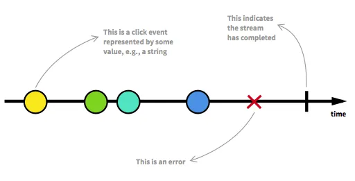
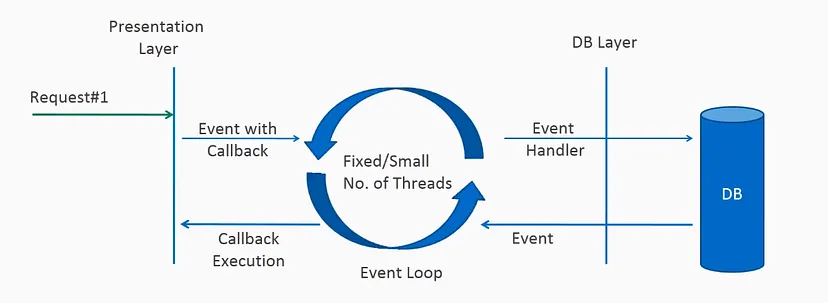
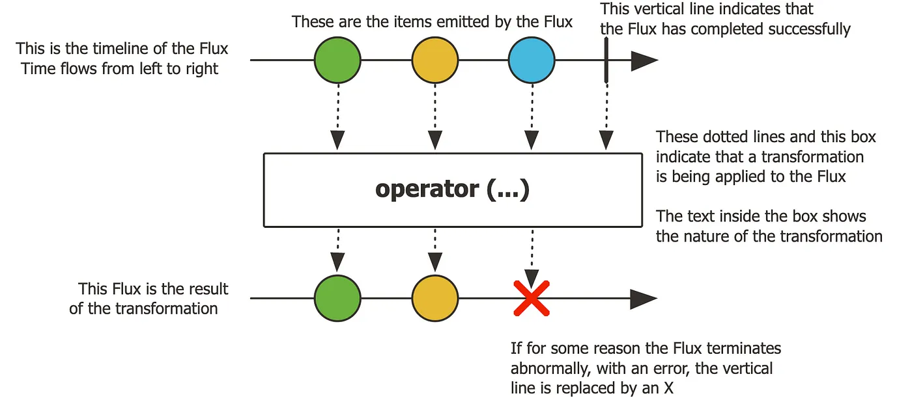
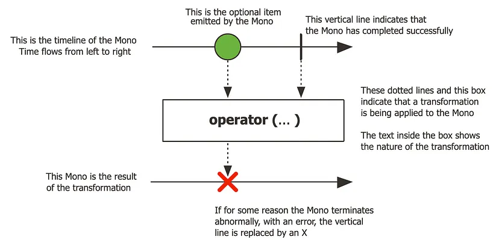

# Ghi chú cho bản thân:

<details>
<summary><strong>Java Reactive Programming</strong></summary>

- <details>
  <summary>
      <b>Một số hiểu sai</b>
  </summary>

  - Reactive Programming không nhất thiết phải có **Asynchronous**, chúng ta có thể code **Synchronous**.

  </details>

- <details>
    <summary>
        <b>Use case</b>
    </summary>

  - **User events**: Đặc biệt là khi làm việc với các tác vụ bên phía UI, Front End. Khi user thực hiện một sự kiện
    nào đó thì cần thực hiện một **hành động** tương ứng cho sự kiện đấy.

  - **IO resposne**: Khi user thực hiện một input gì đấy chẳng hạn đọc file, sẽ có một luồng input diễn ra và sau khi
  đọc xong, cần thực hiện một **hành động** nào đó.
  </details>

- <details>
  <summary>
  <b>Tại sao lại cần quan tâm?</b>
  </summary>

  - <details>
    <summary><b>Câu hỏi</b></summary>

    Tại sao chúng ta lại phải quan tâm các vấn đề ở phần **Use case** khi mà đó là các việc xảy ra ở UI trong khi Java
    là ngôn ngữ được thực hiện đa số ở server-side?
    Quá trình hoạt động chủ yếu của server side là:

    - Nhận request đến.
    - Server thực hiện một số tác vụ.
    - Response dữ liệu.

    Trông có vẻ là **synchronous**? Chúng ta không bỏ ngang và làm một tác vụ gì khác, thế tại sao ta - developer
    back-end phải quan tâm đến reactive programming? Về cơ bản request phải **chờ request thực hiện xong** thì mới trả về client, đó là đặc trưng cơ bản của **HTTP**.
    </details>

  - <details>
    <summary><b>Yêu cầu của ứng dụng hiện đại</b></summary>
      Các ứng dụng hiện đại yêu cầu đến các vấn đề sau:

    - **High data scale** - dữ liệu truyền tải lớn.
    - **High usage scale** - số lượng người dùng lớn.
    - **Cloud based costs** - với sự bùng nổ của các giải pháp đám mây, hiện nay chúng ta thường thuê một dịch vụ
    lưu trữ bên thứ ba nên sẽ quan tâm đến vấn đề truyền tải hơn để tiết kiệm chi phí.
    </details>

  - <details>
     <summary>
      <b>Xem xét ví dụ & nhận ra vấn đề</b>
     </summary>

    **Ví dụ 1:** Vấn đề gì với đoạn code dưới đây?

    ```java
    @GetMapping("/users/{userId}")
     public User getUserDetails(@PathVariable String userId) {
         User user = userService.getUser(userId);
         UserPreferences prefs = userPreferencesService.getPreferences (userId);
         user.setPreferences (prefs);
         return user;
     }
    ```

    Đoạn code trên thực hiện hai thao tác:

    - a. Lấy user từ **User Service**.
    - b. Lấy user preferences từ **User Preferences Service**.

    Ta thấy hai thao tác này đang block lẫn nhau, thao tác `a.` cần phải diễn ra trước sau đó đến thao tác `b.` trong
    khi trên thực tế, hai thao tác này không hề phụ thuộc lẫn nhau => **Unnecessarily sequential**

    **Ví dụ 2:** Sơ đồ dưới đây thể hiện hoạt động của web server một cách khái quát nhất:
    

    Về cơ bản thì:

    - Khi web server nhận được request, nó thêm một thread mới để handle request đó.
    - Sau đó một thread mới đến trong khi thread trước đó vẫn đang xử lí, web server sẽ spawn thêm một thread mới.
    - Nghĩa là, **một thread xử lí càng lâu** sẽ khiến cho **server có nhiều thread cùng tồn tại**.

    Ta thấy được đến một lúc nào đó, số lượng thread sẽ đạt giới hạn và server sẽ không thể spawn thêm thread mới => **Idling threads**
    </details>

  - <details>
    <summary>
    <b>Cách giải quyết - Old Concurrency APIs</b>
    </summary>

    Ta sử dụng các **Concurrency APIs** để giải quyết. Cụ thể là ta sẽ dùng hai class **Future** và **CompletableFuture** đã có từ Java 8:

    ```java
     CompletableFuture<User> userAsync = CompletetableFuture
         .supplyAsync(() => userService.getUser(userId));
    ```

    Vấn đề là khi chúng ta sử dụng nó trong SpringBoot sẽ khiến code của chúng ta trông rất lộn xộn như sau:

    ```java
    @GetMapping("/users/{userId}")
    public User getUserDetails(@PathVariable String userId) {
        CompletetableFuture<User> userAsync = CompletetableFuture.supplyAsync(() => userService.getUser(userId))
        CompletetableFuture<UserPreferences> userPreferencesAsync = CompletetableFuture.supplyAsync(() => userPreferencesService.getPreferences(userId))
        CompletetableFuture<Void> bothFutures = CompletetableFuture.allOf(userAsync, userPreferencesAsync)
        bothFutures.join()
        User user = userAsync.join();
        UserPreferences prefs = userPreferencesAsync.join();
        user.setPreferences(prefs);
        return user;
    }
    ```

    Ngoài ra, chúng ta cần phải thực hiện **tất cả các bước trên** chỉ để **hai tác vụ** được chạy **đồng thời**.

    Việc gọi hàm `userAsync.join()` vẫn sẽ khiến thread bị block, thread này vẫn cần phải **chờ cả hai tác vụ hoàn
    thành** thì sau đó mới return, bởi vì endpoint này return về **Object User**, thế nên thread phải đợi cả hai tác
    vụ trên hoàn thành để lấy được đầy đủ thông tin của User.

    Cách tiếp cận này **cải thiện** được việc hai tác vụ bây giờ sẽ **chạy song song** chứ không còn **chạy tuần tự**.
    Thế nhưng **thread vẫn bị block**.

    **Vấn đề tồn đọng**:

    1. Dev phải làm quá nhiều thứ.
    2. Error handling rất khó và lộn xộn.
    3. Về cơ bản vẫn là "tuần tự".

    **=> Cần giải pháp tốt hơn.**
    </details>

  - <details>
    <summary>
    <b>Cách giải quyết - Reactive Programming</b>
    </summary>

    Với việc sử dụng **Reactive Programming** chúng ta sẽ code như sau:

    ```java
     @GetMapping("/users/{userId}")
     public Mono<User> getUserDetails(@PathVariable String userId) {
         return userService.getUser(userId)
             .zipWith(userPreferencesService.getPreferences(userId))
                 .map(tuple -> {
                     User user = tuple.getT1();
                     user.setUserPreferences(tuple.getT2());
                     return user;
                 });
     }
    ```

    Sự khác biệt ở đây là gì?
    
    1. Code dễ đọc hơn trước đó.
    2. Dễ dàng thấy return type của method bây giờ không còn là `User` nữa mà được bọc trong một class `Mono<User>`. Việc bọc đối tượng User này trong một lớp `Mono` sẽ cho phép controller return mà **không bị block thread**.

    Reactive programming trong Spring WebFlux sử dụng non-blocking I/O và một mô hình lập trình bất đồng bộ để xử lý các yêu cầu. Điều này có nghĩa là khi một yêu cầu đến và yêu cầu dữ liệu (ví dụ: từ cơ sở dữ liệu), hệ thống sẽ không block thread để chờ dữ liệu đó. Thay vào đó, thread sẽ được giải phóng để làm việc khác, và khi dữ liệu sẵn sàng, một thread khác sẽ xử lý phần tiếp theo của pipeline.
    </details>

 ### Lưu ý về Reactive Programming:
 Khi nói về **Reactive Programming**:

 - Thay đổi cách chúng ta nghĩ về **flow**.
 - Thay đổi cách chúng ta nghĩ về **data**.
 - Tương thích Java thông qua `Flow` interface từ Java 9.
 - Không phù hợp với các dự án nhỏ.

 Để sử dụng Reactive, chúng ta cần có hiểu biết về **Collection Stream**.

 > **Java Stream Refresh**:
 > - Là một chuỗi các data.
 > - Chúng ta tập trung vào tính toán.
 > - Không quan tâm đến cách mà dữ liệu được lưu trữ trong một stream.
 > - Internal Iteration, chúng ta không chủ động thực hiện loop qua data.
 > - Một số operator phổ biến trong Stream: `map`, `filter`, `flatMap`, `findFirst`, ...

 ### Ý tưởng nền tảng:
 Có thể nói, Reactive chính là sự kết hợp của hai Design Pattern nổi tiếng khác là _Iterator Pattern_ và _Observer Pattern_:
 - Với Iterator Pattern ta có đoạn code như sau: 
    ```java
      myList.forEach(element -> System.out.println(element))
    ```
 - Với Observer Pattern ta có đoạn code như sau:
    ```java
      eventChannel.addObserver(event -> System.out.println(event))
    ```
 - Điểm khác biệt ở đây chỉ là **bên nào control** việc push data? Đối với *Iterator* thì đó là chính chúng ta, còn đối với *Observer* thì đó là Event hay Publisher.
 - Reactive là một "nỗ lực" để kết hợp hai hàm trên, một thứ gì đó tương tự thế này:
    ```java
      eventChannel
        .forEach(event -> event != null)
        .addOserver(event -> System.out.println(event))
    ```

 ### Khái niệm:
 Có thể giới thiệu ngắn ngọn Reactive = Asynchronous + Non-Blocking I/O (NIO), có nghĩa là một chương trình được gọi là Reactive nó sẽ đảm bảo được 2 yếu tố là Asynchronous (xử lý bất đồng bộ) và Non-Blocking I/O.

 Bằng cách viết những đoạn mã asynchronous và non-blocking, chương trình sẽ cho phép switch qua các tách vụ khác mà đang sử dụng cùng một I/O resource, và có thể quay lại sử lý tiếp khi tác vụ đó hoàn thành. Do đó với reactive programing chương trình có thể sử lý nhiều request hơn trên cùng một tài nguyên hệ thống.

 Reactive và non-blocking nhìn chung thì không làm cho ứng dụng chạy nhanh hơn. Lợi ích mà nó được kỳ vọng là ứng dụng chịu tải được tốt hơn mà chỉ yêu cầu ít tài nguyên hơn.

 ### Data Stream:
 Mỗi Stream sẽ emit ra ba thứ là: giá trị trả về (`return data`), lỗi (`error`) hoặc một tín hiệu hoàn thành (`completed signal`) nếu trong trường hợp ta không quan tâm tới giá trị trả về. Và cũng giống như Stream API trong Java 8, reactive stream sẽ không làm gì (không hoạt động) cho tới khi ta subscribe (lắng nghe) chúng. Hãy luôn ghi nhớ rằng: Không có gì xảy ra cho đến khi subscribe.

 Với mỗi loại emit, Stream sẽ định nghĩa từng function để xử lý, một function để hứng `return data` , một function khác xử lý `error` , và một function nữa để nhận `completed signal`. Việc lắng nghe Stream được gọi là **Subscribe**, các function được gọi là **Observers** , và **Subject** được quan sát ở đây là một Stream.

 Đặc điểm của mỗi Stream đó là Immutability (bất biến), muốn xử lý hoặc thay đổi dữ liệu trong Steam ta luôn phải tạo một Stream mới từ Stream gốc bằng các function như `filter`, `map`, `reduce`

 Ngoài ra với Reactive chúng ta cũng có thể gộp nhiều Stream thành một bằng các function như `merge`, `concat` hay `zip`

 
  
 ### Event Loop:
 Event Loop thực tế là một vòng lặp vô tận, để lắng nghe và xử lý những event từ event queue một cách tuần tự, và sẽ trả về ngay lập tức sau khi nó đăng ký một call back tương ứng với event đó. Call back sẽ được kích hoạt (trigger) khi dữ liệu được trả về từ một resource (DB, file hay network call) hay từ một error đã xảy ra.

 
  
 Event loop thông thường sẽ được chạy trên duy nhất 1 thread, tuy nhiên để sử dụng hiệu quả số lượng CPU Core những Servlet containers hỗ trợ Reactive như Netty sẽ quản lý Event Loop thông qua một Event Loop Group, mỗi Event Loop sẽ chạy trên 1 thread trên từng CPU Core riêng biệt, và số lượng Event Loop sẽ không được nhiều hơn số CPU Cores hiện có của nền tảng phần cứng nó đang chạy.
</details>

<details>
<summary><strong>Project Reactor</strong></summary>

Trong hệ sinh thái của JVM để đạt được reactive programming, một dự án (project) đã được ra đời, đó chính là Project Reactor và hạt nhân (core) của project chính là reactor-core. Nó cung cấp cho chúng ta những bộ thư viện để giúp lập trình viên dễ dàng thao tác và xử lý Data Stream trong Reactive.

Đặc điểm chính của Reactor đó là cung cấp hai loại kiểu dữ liệu (data type) của luồng dữ liệu (Publisher) đó là **Flux** và **Mono**.

- <details>
    <summary><strong>Flux</strong></summary>

    Là một Stream có thể phát ra **0..n** phần tử, có thể hình dung nó là một List dữ liệu. Ví dụ tạo đơn giản:
    ```java
      Flux<Integer> just = Flux.just(1,2,3,4);
    ```
    Và cũng giống như khái niệm về Reactive, có 3 tín hiệu mà Flux emit ra để Subscribe có thể nhận được đó là **onNext()** để hứng return data, **onComplete()** để nhận tín hiệu Stream hoàn thành và **onError()** để nhận giá trị lỗi trả về.
    
  </details>

- <details>
    <summary><strong>Mono</strong></summary>

    Là một Stream có thể phát ra **0..1** phần tử. Nó hoạt động gần giống như Flux, chỉ là bị giới hạn không quá một phần tử hoặc không có phần tử nào (rỗng) . Ví dụ:
    ```java
      Mono<String> just = Mono.just("ABC"); // Mono với 1 phần tử
      Mono<Void> just = Mono.empty(); // Mono với 0 phần tử (rỗng)
    ```
    Cũng giống như Flux, Mono cung cấp 3 function **onNext()**, **onComplete()** và **onError()** để Subscribe thao tác với dữ liệu được trả về.

    Mono cũng có thể truyển đổi thành một Flux, ví dụ 2 hoặc nhiều Mono có thể gộp thành một Flux bằng cách sử dụng function **concatWith()**, ví dụ `Mono#concatWith(Publisher)` sẽ trả về một Flux. Hay sử dụng `Mono#then(Mono)` để trả về một Mono khác với mục đích kết thúc một Stream mà không quan tâm tới dữ liệu của Mono gốc. Điểm khác nhau giữa `Mono#then` và `Mono#map` đó là `then` hoạt động dựa trên tính hiệu `onComplete` mặc dù Mono gốc có thể empty, trong khi map hay `flatmap` chỉ hoạt động dựa trên tín hiệu `onNext` , có nghĩa là chỉ hoạt động khi Mono gốc có dữ liệu trả về (not empty).
    
  </details>

- <details>
    <summary><strong>Subscribe</strong></summary>

    Như đã nói bên trên rằng **“không có gì xảy ra cho đến khi subscribe”**, các Stream như Mono hay Flux sẽ không hành động gì cả cho tới khi nó được Observer hay Subcriber (lắng nghe). Do vậy trong Reactor có cung cấp một function **subscribe()** để thực hiện lắng nghe Stream.
    Ví dụ để subcribe một Flux với basic method không có đối số (arguments)
    ```java
    Flux<Integer> ints = Flux.range(1, 3); //Tạo một Flux với 3 phần tử từ 1->3
    ints.subscribe(); // Thực hiện lắng nghe trên Flux vừa tạo
    ```
    Với ví dụ trên thì sẽ không có out-put nào tạo ra, để có thể bắt (catch) được các out-put thì ta sẽ truyền một đối số là `Consumer` vào **subscribe()** ví dụ:
    ```java
    Flux<Integer> ints = Flux.range(1, 3); 
    ints.subscribe(i -> System.out.println(i)); // subcribe Flux và in ra dữ liệu trả về của nó
    ```
    Output:
    ```java
    1
    2
    3
    ```
    #### Error Event
    Một lỗi có thể được sử lý ngay trong subcribe (error handler) như ví dụ sau:
    ```java
    Flux<Integer> ints = Flux.range(1, 6) //(1)
      .map(i -> { // (2)
        if (i <= 3) {
           return i;
        }
        throw new RuntimeException("Got to 4"); 
      });
    ints.subscribe(i -> System.out.println(i), //(3)
      error -> System.err.println("Error: " + error)); //(4)
    ```
    >- (1) Tạo một Stream Flux có 4 phần tử từ 1-> 6
    >- (2) Map lại Stream hiện tại ra một Steam mới mà chỉ được phép có 3 phần tử từ 1->3 nếu lớn hơn sẽ throw ra một Exception
    >- (3) Print ra dữ liệu output của Stream mới được tạo
    >- (4) sử dụng consumer là error để kết thúc Stream và out-put ra lỗi nếu có
    Output:
    ```java
    1
    2
    3
    Error: java.lang.RuntimeException: Got to 4
    ```
    #### Completed Event
    Nếu có một `error` được `throw` ra thì Stream sẽ dừng lại (completed) ngay lập tức. Nếu không có lỗi xảy ra thì ta có thể tạo một event completed khi Stream kết thúc như ví dụ:
    ```java
    Flux<Integer> ints = Flux.range(1, 4); //(1)
    ints.subscribe(i -> System.out.println(i), //(2)
      error -> System.err.println("Error " + error), //(3)
      () -> System.out.println("Done")); (4)
    ```
    >- (1) Tạo một Stream Flux có 4 phần tử từ 1-> 4
    >- (2) Print ra dữ liệu output của Stream
    >- (3) Sử dụng consumer là error để completed Stream và out-put ra lỗi nếu có
    >- (4) Sử dụng consumer là () để completed Stream và out-put ra event complete
    Output:
    ```java
    1
    2
    3
    4
    Done
    ```
    Subscribe có thể yêu cầu một hành động nào đó, ví dụ như yêu cầu số lượng dữ liệu được emit ra trước khi Steam được complete bằng cách sử dụng `sub` , ví dụ:
    ```java
    Flux<Integer> ints = Flux.range(1, 4);
    ints.subscribe(i -> System.out.println(i),
      error -> System.err.println("Error " + error),
      () -> System.out.println("Done"),
      sub -> sub.request(10));
    ```
    Stream trên sẽ bị treo (hangs) vĩnh viễn (không bao giờ completed) trừ khi Stream được cancel, bởi vì Subscribe đã yêu cầu chỉ completed cho tới khi nhận được đủ 10 phần tử.
    Output: Event “Done” sẽ không bao giờ được output ra.
    ```java
    1
    2
    3
    4
    ```
    #### Cancel Event
    Function Subscribe trả về một kiểu dữ liệu là `Disposable` và `Disposable Interface` có cung cấp một method là **dispose()** để giúp một Stream có thể bị hủy bỏ (cancel) ví dụ:
    ```java
    Flux.just(1,2,3).subscribe().dispose();
    ```
    Stream sẽ ngay lập tức bị cancel ngay sau khi nó được Subscribe
  </details>
</details>

<details>
<summary><strong>Ứng dụng</strong></summary>

#### Block một Flux
Để collect một `Flux<Integer>` thành một `List<Intetger>`, ta cần phải **block** nó, cách tiếp cận đơn giản nhất là sử dụng `Flux#toStream()`, hàm này sẽ **block thread** vì ta phải đợi cho Flux này `emmit` **toàn bộ dữ liệu**, sau đó mới tiến hành convert nó sang `Stream`, rồi sang `List`.
```java
var flux = Flux.range(1, 10).delayElements(Duration.ofSeconds(1)) // add delay
var list = flux.toStream().toList(); // Hàm này sẽ khiến thread bị block 10s
System.out.println(list); // sau 10s hàm này mới được chạy
System.out.println(list.size());
```
Output:
```java
[1, 2, 3, 4, 5, 6, 7, 8, 9, 10]
10
```
#### Block một Mono
Để collect một `Mono<Integer>` thành một số **Integer**, ta cần phải **block** nó bằng hàm `Mono#block()`.
```java
var mono = Mono.just(42).delayElement(Duration.ofSeconds(1)); // add delay
var x = mono.block(); // hàm này sẽ khiến thread bị block 1s
System.out.println(x); // hàm này 1s sau mới được chạy
```
Output:
```
42
```

### Operator - Reactive all the way
**Block** một Flux hoặc Mono về cơ bản là đi ngược lại với mục tiêu sử dụng Reactive, bởi vì mục đích của Reactive là để chúng ta hạn chế block thread.
Chúng ta sẽ muốn "Reactive" trong mọi trường hợp và tránh **block**.
Nếu bắt buộc phải **block** một tác vụ gì đó, chúng ta sẽ muốn các tác vụ còn lại Reactive.
Lấy ví dụ với HTTP Request, khi request đến server, nó cần phải **block**, và từ lúc đó mọi thứ còn lại phải **Reactive**
Ví dụ:
```java
@GetMapping("/users/{userId}")
public Mono<User> getUserDetails(@PathVariable String userId) {
  var user = userService.fetchUserMono(userId)
  // check xem user có active không?
  // fetch user details
  // đổ thông tin vào user rồi return
}
```
**Operator Functions** cho phép chúng ta chain nhiều thao tác `Mono` và `Flux` với nhau thông qua các hàm như `filter`, `map`, ... Các Operator này sẽ chỉ chạy **sau khi event được resolved**. Việc này giống như chúng ta đang "set up trước một kịch bản reactive" dành cho `Mono` và `Flux` thay vì phải **chờ đợi chúng**.

### Cách Reactive thao tác với thread
#### Schedulers 
Được sử dụng để chỉ định các thread hoặc pool thread cho các thao tác reactive. Một số schedulers phổ biến:
- **Schedulers.parallel()**: Sử dụng một pool các thread để thực hiện các tác vụ tính toán.
- **Schedulers.boundedElastic()**: Được thiết kế cho các tác vụ blocking, như truy vấn cơ sở dữ liệu hoặc gọi API bên ngoài.
- **Schedulers.single()**: Sử dụng một thread đơn để thực hiện các tác vụ.
- **Schedulers.immediate()**: Thực hiện các tác vụ trên thread hiện tại (thường là thread chính).

Để chỉ định thread thủ công, ta sử dụng hàm **publishOn** để thay đổi scheduler cho các toán tử sau nó trong chuỗi xử lý hoặc hàm **subscribeOn** để thay đổi scheduler cho toàn bộ chuỗi từ điểm bắt đầu.

#### Trường hợp sử dụng

Trường Hợp Không Chỉ Định Scheduler:
```java
Flux<Integer> flux = Flux.just(1, 2, 3)
    .map(num -> doBlockStuff(num)); // Blocking operation

flux.subscribe(num -> System.out.println(num)); // Runs on main thread

System.out.println("End"); // Will print after the blocking operations
```
Kết quả: **main thread** bị block bởi **doBlockStuff**.

Trường Hợp Chỉ Định Scheduler:
```java
Flux<Integer> flux = Flux.just(1, 2, 3)
    .publishOn(Schedulers.boundedElastic()) // Switch to boundedElastic scheduler
    .map(num -> doBlockStuff(num)); // Blocking operation

flux.subscribe(num -> System.out.println(num));

System.out.println("End"); // Will print immediately
```
Kết quả: Các tác vụ blocking chạy trên thread của **boundedElastic scheduler**, **không block** main thread.

Các Tình Huống Cần Sử Dụng Scheduler:
1. **Tác vụ blocking**: Sử dụng `publishOn(Schedulers.boundedElastic())` hoặc `subscribeOn(Schedulers.boundedElastic())` để chuyển tác vụ blocking sang một thread pool khác.
2. **Tác vụ tính toán**: Sử dụng `Schedulers.parallel()` cho các tác vụ yêu cầu tính toán cao.
</details>